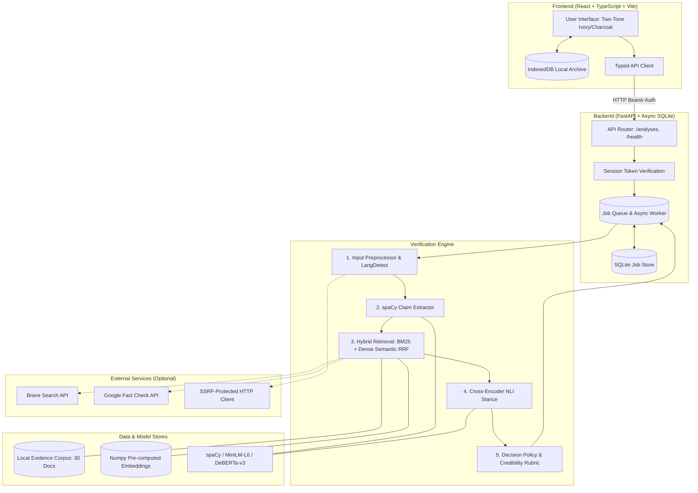

# ClaimLens System Architecture

## Official Project Title
**AI-Based Misinformation Detection System Using Natural Language Processing, Information Retrieval and Source Credibility Analysis**

**Short Name:** ClaimLens

---

## 1. System Overview

ClaimLens is designed as a decoupled, privacy-preserving, and locally runnable client-server application for factual claim extraction and verification. The system operates in two distinct modes:

1. **Local Corpus Mode (Default, Fully Offline):** Uses a curated, versioned repository of verified scientific, geographic, historical, and health passages alongside local small language models (spaCy, Sentence-Transformers, DeBERTa NLI). No external API calls are made.
2. **Live Web Mode (Optional):** Augments local verification with live web search snippets via Brave Search API and fact-checking reviews via Google Fact Check Tools API, safeguarded by strict SSRF protection.

---

## 2. Component Specifications

### 2.1 Frontend Architecture (`frontend/`)
- **Framework:** React 18 with TypeScript in strict mode.
- **Build Tool:** Vite 5 with `@vitejs/plugin-react`.
- **Styling & Design System:** Tailwind CSS v3 with a strict **two-tone palette**:
  - Warm Ivory: `#F4F1EA`
  - Charcoal: `#232323`
  - Zero accent hues (no blue, green, red, purple). Outcome distinctions rely on borders, solid fills, and distinct icons for color-blind accessibility.
- **Typography:**
  - Headlines: *Source Serif 4*
  - Body & Controls: *Inter*
  - Monospace Data: *JetBrains Mono / System Monospace*
- **Local Persistence:** Client-side IndexedDB database (`claimlens-history`) powered by the `idb` library. Completed analyses are archived locally so reports can be re-inspected without server roundtrips.

### 2.2 Backend Architecture (`backend/`)
- **Framework:** FastAPI with Python 3.11+.
- **Data Persistence:** SQLAlchemy 2.0 async engine with `aiosqlite` on SQLite (`claimlens.db`).
- **Concurrency & Offloading:** Model inference (spaCy linguistic parsing, PyTorch embedding encoding, and DeBERTa cross-encoder classification) is offloaded to a dedicated background single-thread executor (`ThreadPoolExecutor(max_workers=1)`) to prevent blocking the asynchronous event loop.
- **Job Lifecycle:** Asynchronous polling architecture. Client receives a `202 Accepted` response with an opaque job UUID and a cryptographic `access_token`. Client polls with exponential backoff (`GET /api/v1/analyses/{id}`) until completion.

---

## 3. Data Flow

1. **Submission:** User submits text or URL.
2. **Validation:** Backend validates character length (10,000 char limit) and language (`langdetect` enforces English).
3. **Queueing:** Job is committed to SQLite with status `queued`, returning a token.
4. **Extraction:** spaCy segments sentences, tags entities, extracts noun phrases, and filters out questions, commands, and subjective opinions. Top 6 factual propositions are isolated.
5. **Retrieval:** For each claim:
   - BM25Okapi scores sparse keyword overlap across corpus passages.
   - Sentence-Transformers (`all-MiniLM-L6-v2`) computes dense semantic embeddings and cosine similarities.
   - Reciprocal Rank Fusion (RRF, $k=60$) merges both rankings.
   - Jaccard similarity ($0.85$ threshold) deduplicates near-identical passages.
   - Top 5 diverse passages are selected.
6. **Stance Detection:** Cross-encoder (`nli-deberta-v3-small`) pairs each passage (premise) with the claim (hypothesis), producing entailment, contradiction, and neutral probabilities.
7. **Decision Policy:** Transparent thresholds (Entailment: 0.65, Contradiction: 0.65, Relevance: 0.25) determine the claim outcome: `supported`, `contradicted`, `conflicting`, `insufficient`, or `not_checkable`.
8. **Source Credibility:** Page-level metadata and registry publisher signals are mapped into qualitative provenance categories (`documented`, `partially_documented`, `unknown`).
9. **Finalization:** The report is saved to the database and returned to the client.

---

## 4. Security Architecture

- **SSRF Protection (`SafeFetcher`):**
  - Restricts schemes strictly to `http` and `https`.
  - Rejects embedded credentials in URLs (`user:pass@host`).
  - Restricts destination ports to standard web ports (80, 443, 8080, 8443).
  - Resolves hostnames via DNS and rejects loopback (`127.0.0.1`, `::1`), private ranges (`10.0.0.0/8`, `172.16.0.0/12`, `192.168.0.0/16`), cloud metadata endpoints (`169.254.169.254`), and multicast addresses.
  - Manually follows redirects up to 5 hops, validating resolved IPs at each hop against DNS rebinding.
- **Rate Limiting & Queue Limits:** The server rejects requests with HTTP 429 when concurrent active analyses reach maximum capacity (`MAX_QUEUE_SIZE = 10`).
- **Authentication:** Ephemeral SHA-256 hashed tokens protect access to individual analysis reports.
